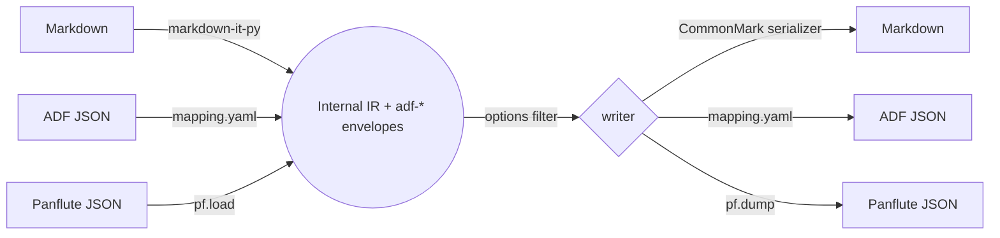

# adflux

[](https://github.com/mikejhill/adflux/actions/workflows/ci.yml)
[](https://github.com/mikejhill/adflux/actions/workflows/release.yml)
[](https://pypi.org/project/adflux/)
[](https://pypi.org/project/adflux/)
[](LICENSE)

A pure-Python converter between Markdown (CommonMark + GFM) and Atlassian
Document Format (ADF) — the JSON document model used by Confluence and
Jira. Round-trips losslessly, including ADF-only constructs like panels,
status badges, mentions, task lists, expand sections, and macros.



## Why adflux

ADF is JSON, but no mature pure-Python tool converts it to and from
Markdown without losing information. `adflux` fills that gap:

- **No system dependencies.** `pip install adflux` — no Pandoc binary,
  no Node, no Ruby.
- **Lossless ADF round-trips.** A declarative `mapping.yaml` plus a small
  envelope convention round-trips every ADF construct, including ones
  the library has never seen.
- **Idiomatic Markdown output.** Panels become GitHub alert blockquotes,
  expand sections become `<details>`, smart cards become autolinks. The
  output looks correct in GitHub, VS Code, and any standard viewer.
- **Conversion options** make lossy / lossless behavior explicit and
  selectable per call.

## Install

```bash
pip install adflux
```

Requires Python ≥ 3.11. Linux, macOS, and Windows are CI-tested.

## Quick start

```python
from adflux import convert

# Markdown → ADF JSON
adf = convert(open("README.md").read(), src="md", dst="adf")

# ADF JSON → Markdown, dropping ADF-only constructs to plain content
md = convert(adf, src="adf", dst="md", options={"envelopes": "drop"})
```

```bash
adflux convert --from md  --to adf README.md > readme.adf.json
adflux convert --from adf --to md page.json
adflux convert --from adf --to md --option envelopes=drop page.json
adflux validate page.adf.json
adflux list-options
```

Full API and CLI reference: [`docs/usage.md`](docs/usage.md).

## Conversion options

| Option         | Choices                        | Default  | Description                                          |
| -------------- | ------------------------------ | -------- | ---------------------------------------------------- |
| `envelopes`    | `keep`, `drop`, `keep-strict`  | `keep`   | How ADF envelope nodes are handled on lossy targets. |
| `jira-strict`  | `true`, `false`                | `false`  | Reject non-Jira ADF nodes during serialization.      |

Worked examples: [`docs/options.md`](docs/options.md).

## Markdown rendering of ADF constructs

| ADF construct                            | Rendered as                                          |
| ---------------------------------------- | ---------------------------------------------------- |
| `panel` (info/note/warning/…)            | GitHub alert blockquote (`> [!NOTE]`, `> [!TIP]`, …) |
| `expand`                                 | `<details><summary>title</summary>…</details>`       |
| `inlineCard` / `blockCard` / `embedCard` | Autolink (`<https://…>`)                             |
| `taskList` / `taskItem`                  | GFM task list (`- [ ]`, `- [x]`)                     |
| `emoji`, `mention`                       | Plain text (`🚀`, `@alice`)                          |
| Everything else                          | HTML-comment marker (`<!--adf:status …-->`)          |

The reader recognises every form on its way back, so `MD → ADF → MD` is
stable.

## Supported formats

| Format     | Aliases     | Description                                          |
| ---------- | ----------- | ---------------------------------------------------- |
| Markdown   | `md`, `markdown` | CommonMark + GFM via markdown-it-py             |
| ADF        | `adf`       | Atlassian Document Format JSON                       |
| Panflute   | `panflute`, `pf` | Pandoc JSON AST for integration with panflute tools |

## How it works

- **IR**: an in-memory document tree built on
  [panflute](https://github.com/sergiocorreia/panflute) AST classes
  (used purely as Python data structures — no Pandoc binary involved),
  with `Div` / `Span` envelopes for ADF-only constructs.
- **Envelopes**: class prefix `adf-<nodeType>` plus a base64-JSON blob
  for complex attributes. A universal `adf-raw` fallback guarantees zero
  data loss.
- **Mapping**: every ADF node type is described in
  [`src/adflux/formats/adf/mapping.yaml`](src/adflux/formats/adf/mapping.yaml).
  Adding a new node type is a YAML edit.

Deeper dives:
[`docs/design.md`](docs/design.md) ·
[`docs/architecture.md`](docs/architecture.md) ·
[`docs/options.md`](docs/options.md) ·
[`docs/fidelity-matrix.md`](docs/fidelity-matrix.md) ·
[`docs/extending.md`](docs/extending.md) ·
[`docs/e2e-testing.md`](docs/e2e-testing.md).

## Examples

Runnable scripts in [`examples/`](examples):

```bash
python examples/md_to_adf.py README.md
python examples/adf_to_markdown.py
python examples/confluence_roundtrip.py
```

## Development

```bash
git clone https://github.com/mikejhill/adflux
cd adflux
uv sync --all-groups
uv run poe check
```

Common tasks via [poethepoet](https://poethepoet.natn.io/):

```bash
poe test         # unit + integration + round-trip + property tests
poe test-e2e     # live Confluence + Jira round-trip suite (requires .env)
poe lint         # ruff format --check + ruff check
poe typecheck    # ty check src
poe cov          # pytest with coverage report
poe check        # lint + typecheck + test (run before opening a PR)
poe build        # sdist + wheel into ./dist
```

CI runs the full matrix on Linux, macOS, and Windows for Python 3.11–3.13.

## Releasing

Releases are automated. Land changes on `main` using
[Conventional Commits](https://www.conventionalcommits.org/), then run
the **Release** workflow from the GitHub Actions tab. `go-semantic-release`
computes the next version, builds the sdist + wheel, creates a tagged
GitHub Release, and publishes to PyPI via OIDC trusted publishing.

## Contributing

Issues and pull requests are welcome. Before opening a PR:

1. `poe check` must pass (lint + typecheck + tests).
2. Use a Conventional Commit message (`feat:`, `fix:`, `docs:`, …).
3. New ADF node types need a fixture in
   `tests/roundtrip/test_node_coverage.py`.

## License

MIT
