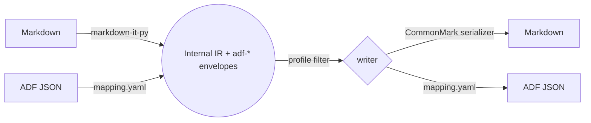

# adflux

[](https://github.com/mikejhill/adflux/actions/workflows/ci.yml)
[](https://github.com/mikejhill/adflux/actions/workflows/release.yml)
[](https://pypi.org/project/adflux/)
[](https://pypi.org/project/adflux/)
[](LICENSE)
[](https://github.com/astral-sh/ruff)
[](https://mypy-lang.org/)

A **pure-Python** document converter with **first-class support for
Atlassian Document Format (ADF)**. Convert losslessly between **Markdown
(CommonMark + GFM)** and **ADF** — including ADF-only constructs like
panels, status badges, mentions, task lists, and Confluence macros.

```text
                ┌────────────────────┐    ┌────────────────────────┐    ┌───────────────┐
   Markdown ──▶│ markdown-it reader │──▶│   internal IR (panflute │◀──│  ADF reader   │◀── ADF JSON
                └────────────────────┘    │   AST + adf-* envelopes│    │ (mapping.yaml)│
                                          └────────────────────────┘    └───────────────┘
                                                       │   ▲
                                                       ▼   │
                ┌────────────────────┐    ┌────────────────────────┐    ┌───────────────┐
   Markdown ◀──│  CommonMark writer │◀──│   profile filter        │──▶│  ADF writer   │──▶ ADF JSON
                └────────────────────┘    └────────────────────────┘    │ (mapping.yaml)│
                                                                        └───────────────┘
```

## Why adflux

ADF is the JSON document model used by Confluence and Jira. There is no
mature pure-Python tool for converting it to/from Markdown without losing
information. `adflux` fills that gap:

- **No system dependencies.** Pure Python — `pip install adflux` is all
  you need. No Pandoc binary, no Ruby, no Node.
- **Lossless ADF round-trips.** A declarative `mapping.yaml` plus a small
  envelope convention round-trips every ADF construct — even ones the
  library has never seen before.
- **Idiomatic Markdown output.** Panels become GitHub alert blockquotes,
  smart cards become autolinks, expand sections become `<details>`. The
  output looks great in GitHub, VS Code, and any standard viewer.
- **Fidelity profiles** make lossy / lossless behavior explicit and
  selectable per call.

## Install

```bash
pip install adflux
```

Requires Python ≥ 3.11. Linux, macOS, and Windows are all supported and CI-tested.

## Quick start

### Library

```python
from adflux import convert

# Markdown → ADF JSON
adf = convert(open("README.md").read(), src="md", dst="adf")

# ADF JSON → Markdown, dropping ADF-only constructs to plain content
md = convert(adf, src="adf", dst="md", profile="pretty-md")
```

### CLI

```bash
adflux convert --from md  --to adf README.md > readme.adf.json
adflux convert --from adf --to md page.json
adflux validate page.adf.json
adflux inspect-ast --from md README.md
adflux list-formats
```

Full API and CLI reference: [`docs/usage.md`](docs/usage.md).

## Fidelity profiles

| Profile        | Behavior on lossy targets                                       |
| -------------- | --------------------------------------------------------------- |
| `strict-adf`   | Preserve every ADF construct (default). Round-trips losslessly. |
| `pretty-md`    | Drop ADF-only envelopes silently; keep their visible content.   |
| `fail-loud`    | Raise `UnrepresentableNodeError` on the first envelope.         |

Worked examples and the full decision matrix:
[`docs/profiles.md`](docs/profiles.md).

## Markdown rendering

ADF carries macros (panels, status badges, expand sections, smart cards, …)
that have no native CommonMark equivalent. adflux renders these as
**idiomatic Markdown** so the output looks great in GitHub, VS Code, and
other standard viewers, while still **round-tripping losslessly** back to
the original ADF:

| ADF construct                       | Rendered as                                         |
| ----------------------------------- | --------------------------------------------------- |
| `panel` (info/note/warning/…)       | GitHub alert blockquote (`> [!NOTE]`, `> [!TIP]`, …) |
| `expand`                            | `<details><summary>title</summary>…</details>`      |
| `inlineCard` / `blockCard` / `embedCard` | Autolink (`<https://…>`)                       |
| `taskList` / `taskItem`             | GFM task list (`- [ ]`, `- [x]`)                    |
| `emoji`, `mention`                  | Plain text (`🚀`, `@alice`)                          |
| Everything else                     | Invisible HTML-comment marker (`<!--adf:status …-->`) |

The reader recognises every form on its way back, so `MD → ADF → MD` is
stable.

## Architecture at a glance



- **IR**: an in-memory document tree (built on
  [panflute](https://github.com/sergiocorreia/panflute) AST classes — used
  purely as Python data structures, no Pandoc binary involved) with
  `Div` / `Span` envelopes for ADF-only constructs.
- **Envelope class prefix**: `adf-<nodeType>` plus a base64-JSON blob for
  complex attributes. A universal `adf-raw` fallback guarantees zero data loss.
- **Mapping**: every ADF node type is described in
  [`src/adflux/formats/adf/mapping.yaml`](src/adflux/formats/adf/mapping.yaml).
  Adding a new ADF node type is a YAML edit.

Deeper dives:

- [`docs/design.md`](docs/design.md) — design rationale & diagrams.
- [`docs/architecture.md`](docs/architecture.md) — module layout.
- [`docs/profiles.md`](docs/profiles.md) — profile semantics.
- [`docs/fidelity-matrix.md`](docs/fidelity-matrix.md) — per-node coverage.
- [`docs/extending.md`](docs/extending.md) — adding nodes, formats, profiles.
- [`docs/e2e-testing.md`](docs/e2e-testing.md) — live Confluence round-trip tests.

## Examples

Runnable scripts in [`examples/`](examples):

```bash
python examples/md_to_adf.py README.md
python examples/adf_to_markdown.py
python examples/confluence_roundtrip.py
```

`examples/sample.adf.json` is a representative ADF document exercising
panels, status badges, code blocks, task lists, and tables.

## Format support

| Format    | Read | Write | Notes                                       |
| --------- | :--: | :---: | ------------------------------------------- |
| Markdown  | ✅   | ✅    | CommonMark + GFM via [`markdown-it-py`][mdit] |
| ADF       | ✅   | ✅    | Custom bridge; JSON-Schema validated        |

[mdit]: https://github.com/executablebooks/markdown-it-py

## Development

```bash
git clone https://github.com/mikejhill/adflux
cd adflux
pip install -e ".[dev]"
```

Common tasks are pre-canned via [poethepoet](https://poethepoet.natn.io/),
so you don't have to remember the exact `pytest` / `ruff` / `mypy`
invocations:

```bash
poe test         # unit + integration + round-trip + property tests
poe test-e2e     # live Confluence Cloud round-trip suite (requires .env)
poe test-all     # everything, including e2e
poe lint         # ruff format --check + ruff check
poe format       # ruff format + ruff check --fix
poe typecheck    # mypy --strict
poe cov          # pytest with coverage report
poe check        # lint + typecheck + test (run before opening a PR)
poe build        # python -m build (sdist + wheel into ./dist)
poe clean        # remove caches and build artifacts
```

If you'd rather not install Poe, every task is a thin wrapper around the
underlying tools — `pytest`, `ruff`, `mypy`, `python -m build`.

CI runs the full matrix on Linux, macOS, and Windows for Python 3.11–3.13.

## Releasing

Releases are automated. Land changes on `main` using
[Conventional Commits](https://www.conventionalcommits.org/), then run the
**Release** workflow from the GitHub Actions tab. `go-semantic-release`
computes the next version, builds the sdist + wheel, creates a tagged GitHub
Release, and publishes to PyPI via OIDC trusted publishing. See
[`docs/extending.md#releasing`](docs/extending.md#releasing).

## Contributing

Issues and pull requests are welcome. Before opening a PR:

1. `poe check` must pass (lint + typecheck + tests).
2. Use a Conventional Commit message (`feat:`, `fix:`, `docs:`, …).
3. New ADF node types need a fixture in
   `tests/roundtrip/test_node_coverage.py`.

## License

MIT — see [LICENSE](LICENSE).

## Acknowledgements

- [markdown-it-py](https://github.com/executablebooks/markdown-it-py) —
  CommonMark-compliant Markdown parser used for the read path.
- [mdit-py-plugins](https://github.com/executablebooks/mdit-py-plugins) —
  GFM extensions (tables, strikethrough, task lists).
- [panflute](https://github.com/sergiocorreia/panflute) — Pythonic AST
  classes used as the in-memory IR (no Pandoc binary required).
- The Atlassian Document Format
  [schema](https://developer.atlassian.com/cloud/jira/platform/apis/document/structure/).
