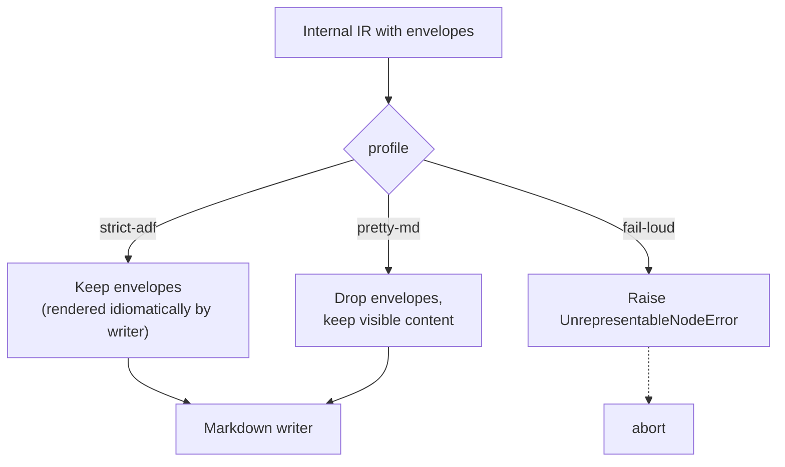
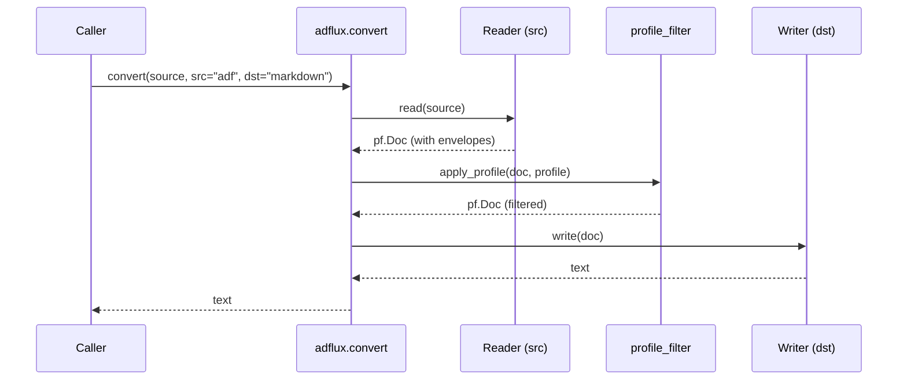

# Design

This document explains _why_ `adflux` is built the way it is. For a
high-level overview see [`architecture.md`](architecture.md). For practical
usage see [`usage.md`](usage.md).

## Goals

1. **Convert losslessly** between Markdown and Atlassian Document Format (ADF),
   including ADF-only constructs (panels, status, mentions, task lists,
   Confluence macros).
2. **Be grammar/config-driven**, not code-driven. Adding an ADF node type
   should not require Python changes — only YAML.
3. **Reuse community tooling** instead of writing yet another Markdown parser.
4. **Be predictable**: explicit fidelity profiles describe exactly how lossy
   conversions behave.

## Why pure Python

`adflux` is a pure-Python library for lossless Markdown↔ADF conversion. It
uses **markdown-it-py** (CommonMark + GFM plugins) for robust Markdown parsing,
and a hand-rolled CommonMark+GFM writer for serialization. These embed
seamlessly into any Python application — no system dependencies required.

For the internal representation (IR), the library reuses **panflute AST classes**
as a convenient, pre-existing tree structure. Panflute is normally used with
the Pandoc binary, but we use it **purely as Python data structures** — the
Pandoc binary is not required, not installed, and not called. This avoids
reinventing an EBNF grammar and bespoke tree while keeping the library
self-contained and deployable anywhere Python runs.

## Why ADF needs a custom bridge

ADF is not a Pandoc-supported format. Its node set overlaps with Markdown for
basic block/inline content but diverges sharply for:

- **Atlassian-specific blocks**: `panel`, `expand`, `mediaSingle`, `taskList`,
  `decisionList`.
- **Atlassian-specific inlines**: `mention`, `emoji`, `status`, `inlineCard`,
  `date`, `placeholder`.
- **Confluence macros**: `extension`, `bodiedExtension`, `inlineExtension`
  with arbitrary opaque parameters.

A Haskell patch to Pandoc is the "right" way to add a new format, but is
inaccessible to most contributors and slow to evolve. Instead, `adflux`
ships a pure-Python bridge that is **declarative** and lives entirely in
config.

## The mapping table

`src/adflux/formats/adf/mapping.yaml` is the single source of truth for ADF
node behavior. Each entry declares:

```yaml
panel:
  pandoc: Div # Internal IR node kind (from panflute AST classes)
  kind: block # block | inline
  envelope_class: adf-panel
  attrs:
    panelType: string
  # children inherit from panflute Div (any blocks)
```

The `MappingEntry.content_kind` field can override the default content shape:

| `content_kind` | Meaning                                       | Example nodes              |
| -------------- | --------------------------------------------- | -------------------------- |
| `block`        | Children are ADF block nodes (the default).   | `panel`, `expand`          |
| `inline`       | Children are ADF inline nodes.                | `taskItem`, `decisionItem` |
| `none`         | Node is a leaf — no `content` array on write. | `mention`, `extension`     |

Adding a new ADF node type is:

1. Add a YAML stanza.
2. Add a fixture in `tests/roundtrip/test_node_coverage.py`.

No Python code is changed.

## The envelope convention

The internal IR (panflute AST classes) has no `Panel` or `Status` nodes, so
`adflux` represents every ADF-exclusive construct as a panflute `Div` (block)
or `Span` (inline) marked with a class prefix:

```text
adf-panel        # block-level ADF "panel"
adf-status       # inline ADF "status"
adf-extension    # Confluence macro
adf-raw          # universal fallback for unmapped node types
```

Scalar attributes (`panelType: "info"`) become flat key/value pairs on the
`Attr`. Complex attributes (nested objects, lists, booleans) are serialised to
a base64-encoded JSON blob under the `data-adf-json` key. This survives a
round-trip through the Markdown reader and writer because attribute syntax is
preserved verbatim.

```mermaid
flowchart LR
  src[ADF JSON node\ntype: panel\nattrs: panelType=info]
  -->|reader| div[Internal IR\nDiv with class adf-panel\nattrs: panelType=info]
  -->|MD writer| md["```\n::: {.adf-panel panelType=info}\n  body\n:::\n```"]
  -->|MD reader| div
  -->|writer| out[ADF JSON node\ntype: panel\nattrs: panelType=info]
```

The `adf-raw` envelope handles the long tail: any ADF node type that does not
appear in `mapping.yaml` is wrapped verbatim in a Div whose blob carries the
entire original JSON object. This gives us **provable zero data loss** for
round-trips, even across Confluence schema upgrades that introduce node types
the library has never heard of.

## Fidelity profiles

Different consumers want different behavior when ADF-only constructs hit a
lossy target like plain Markdown. Profiles encode that as a small immutable
record:



Profiles are interpreted by `adflux.ir.profile_filter.apply_profile`, which
walks the AST before it is handed to the writer. The writer code itself stays
profile-agnostic.

## Pipeline



For ADF on either side the reader and writer are pure Python; all Markdown
reading/writing is also pure Python via markdown-it-py and our CommonMark
writer.

## Error model

Every recoverable failure raises a typed exception from
`adflux.errors`:

| Exception                  | When                                              |
| -------------------------- | ------------------------------------------------- |
| `UnsupportedFormatError`   | `src` or `dst` is not in the registry.            |
| `InvalidADFError`          | ADF JSON fails schema validation.                 |
| `MappingError`             | `mapping.yaml` is malformed or self-inconsistent. |
| `UnrepresentableNodeError` | `fail-loud` profile encountered an envelope.      |

All five inherit from `DocconvError` (the historical base name, kept stable
for catch-all `except` blocks).

## Non-goals

- **Editing ADF semantics.** `adflux` faithfully translates; it does not
  rewrite content (e.g., it will not auto-correct an invalid panel type).
- **Round-tripping non-ADF formats losslessly through ADF.** A Markdown ↔ ADF
  ↔ Markdown trip is best-effort; only ADF ↔ IR ↔ ADF is guaranteed
  lossless.
