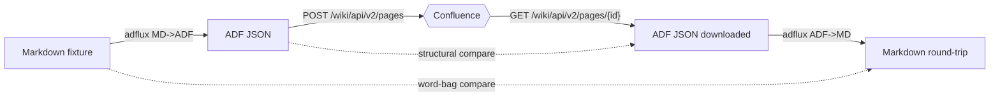

# End-to-end Atlassian tests

The `tests/e2e/` suite verifies adflux against a **live Atlassian Cloud
tenant** by uploading converted ADF, downloading it back, and asserting
both the ADF structure and the round-tripped Markdown survive the trip.

Two surfaces are exercised:

- **Confluence** — pages are created under a per-run parent page,
  fetched back, and deleted on teardown.
- **Jira** — issues are created with ADF descriptions, fetched back,
  and **transitioned to a closed/done status** on teardown (never
  deleted, so they remain auditable in the project).

## What it covers

The flow per Confluence fixture is:



The Jira flow is the same shape but uses the `description` field of a
created issue rather than a page body.

Fixtures live under `tests/e2e/fixtures/`.

## Configuration

The suite reads `.env` at the project root (gitignored). Copy the template:

```bash
cp .env.example .env
$EDITOR .env
```

All E2E variables use the `ADFLUX_E2E_` prefix so they cannot collide
with unrelated tooling that may also reach into the shell environment
for Atlassian credentials.

| Variable                                  | Purpose                                                   |
| ----------------------------------------- | --------------------------------------------------------- |
| `ADFLUX_E2E_ATLASSIAN_SITE`               | Cloud hostname, e.g. `acme.atlassian.net`                 |
| `ADFLUX_E2E_ATLASSIAN_EMAIL`              | Atlassian account email (Basic-auth user)                 |
| `ADFLUX_E2E_ATLASSIAN_API_TOKEN`          | API token from id.atlassian.com (works for both products) |
| `ADFLUX_E2E_CONFLUENCE_SPACE_KEY`         | Space to create test pages in (or `..._SPACE_ID`)         |
| `ADFLUX_E2E_CONFLUENCE_PARENT_PAGE_ID`    | Optional: reuse a fixed parent page instead of ephemeral  |
| `ADFLUX_E2E_JIRA_PROJECT_KEY`             | Optional: enable Jira tests by setting a project key      |
| `ADFLUX_E2E_KEEP_PAGES`                   | `true` keeps pages after each test (default deletes)      |

If any required Confluence key is missing, or the credentials don't
authenticate, the whole module **skips cleanly** — it never fails CI when
un-configured. The Jira suite skips independently when its project key
is absent.

## Running

The repository's [poethepoet](https://poethepoet.natn.io/) tasks wrap
the most common invocations:

```bash
poe test-e2e     # tests/e2e -v
poe test         # everything except e2e
poe test-all     # everything, including e2e
```

Or invoke `pytest` directly:

```bash
pytest tests/e2e -v
pytest -m e2e
pytest --ignore=tests/e2e   # skip live tests
```

Each Confluence test creates a uniquely-named page (`adflux E2E
[<run-id>] <fixture>`) under a per-run parent page; both are removed on
teardown unless `ADFLUX_E2E_KEEP_PAGES=true`. Each Jira test creates an
issue with a `adflux E2E [<run-id>]` summary and transitions it to a
done status on teardown.

## What the Confluence assertions guarantee

For every fixture the test guarantees:

1. `adflux` produces ADF that **passes the JSON-schema validator**.
2. The ADF contains the **required node types** for the fixture (e.g.
   `panel` must appear in the panels fixture).
3. **Confluence accepts the upload** (no 4xx from
   `POST /wiki/api/v2/pages` with `representation=atlas_doc_format`).
4. The ADF **fetched back** still contains every required node type — i.e.
   Confluence didn't drop the macro.
5. The ordered text content of the uploaded ADF equals the fetched ADF
   after stripping volatile attributes (`localId`, etc.).
6. `adflux` ADF→MD on the fetched document is **token-equivalent** to the
   original Markdown (allowing per-fixture ignores for envelope syntax and
   Confluence's known language-alias normalization, e.g. `bash`↔`shell`).

Jira assertions are a subset of the above: schema-valid ADF, accepted
upload, structural round-trip on the fetched description.

## CI

E2E tests run on push to `main`, manual dispatch, and a weekly schedule.
The unit-test workflow excludes `tests/e2e/` so PRs never need live
credentials. Secrets live on the repository's `e2e` GitHub environment
(`ADFLUX_E2E_*` names matching the table above).

## Macro coverage

The current fixtures exercise the following ADF macro families:

| Fixture                        | Nodes covered                                                              |
| ------------------------------ | -------------------------------------------------------------------------- |
| `basic.md`                     | headings, paragraphs, lists, code blocks, tables, blockquotes, rules       |
| `panels.md`                    | `panel` (info / note / warning / success / error)                          |
| `mixed.md`                     | `panel` + `expand` + inline `status` + multi-language code blocks          |
| `inline-macros.md`             | `status` (all colors), `date`, `emoji`, `inlineCard`                       |
| `task-decision-lists.md`       | `taskList` / `taskItem` (TODO/DONE), `decisionList` / `decisionItem`       |
| `layouts.md`                   | `layoutSection` / `layoutColumn` (2- and 3-column layouts)                 |
| `smart-cards.md`               | `inlineCard`, `blockCard`, `embedCard`                                     |

The Jira description ADF profile is **stricter** than Confluence's — it
rejects `taskList`, `decisionList`, `layoutSection`, and any
`extension`/`bodiedExtension` whose key isn't backed by an installed
app. The Jira suite therefore parametrizes over the subset of fixtures
that Jira accepts, declared in `tests/e2e/test_jira_roundtrip.py`.

`extension` / `bodiedExtension` / `inlineExtension` are demonstrated in
`examples/extensions.md` but **not** included in the live E2E suite —
Confluence's REST API also rejects extension nodes whose `extensionKey` /
`extensionType` aren't backed by an installed Forge or Connect app.
